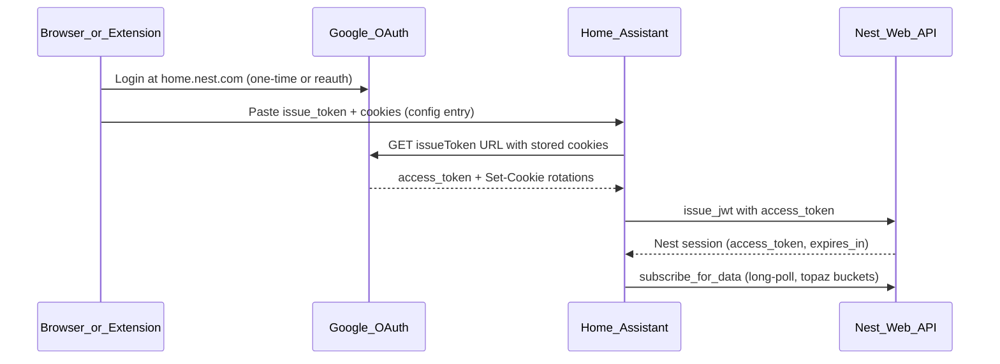
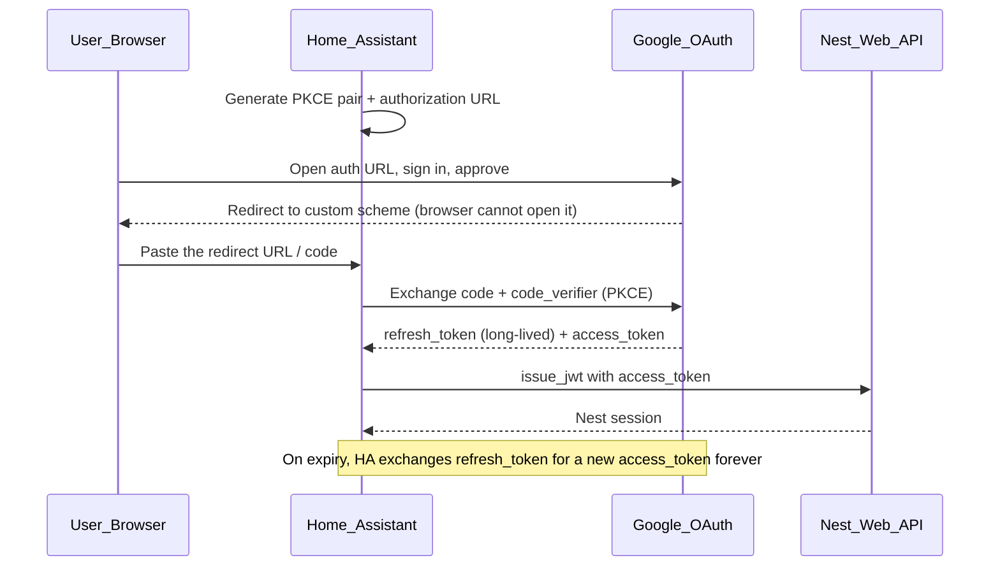

# Nest Protect authentication — limitations and options

This document records what we know about authenticating **ha-nest-protect** with Google/Nest. Read this before re-investigating OAuth or alternative APIs.

Last updated: 2026-06-12 (from debug sessions and community research).

## TL;DR

- **Nest Protect has no official Google API.** The Smart Device Management (SDM) OAuth integration in Home Assistant does not support Protect.
- **This integration uses the same unofficial web API** as home.nest.com (`topaz` device buckets).
- **Recommended: the App token method.** It mints a long-lived OAuth **refresh token** via the installed-app (PKCE) flow — the same kind of durable credential the Nest mobile app holds. It only stops working on a Google password change or explicit revocation, so HA self-refreshes indefinitely with no browser running.
- **Legacy fallback: cookie + `issueToken` auth.** Works, but **Google session cookies expire** on a server-side schedule (~2–5 hours in practice). When Google returns `USER_LOGGED_OUT`, fresh cookies from a browser are required.
- **The Chrome extension works without re-login** because Chrome still has a live Google session — it re-captures cookies, not because HA can self-heal forever.
- **Intercepting the Nest Protect device traffic does not help** (see "Packet capture" below).

---

## What this integration uses today

Stored credentials in the config entry:

| Field | Purpose |
|-------|---------|
| `issue_token` | Full `iframerpc?action=issueToken` URL from Google |
| `cookies` | Google session cookie header string |
| `refresh_token` | Legacy only — see below |

Runtime persistence (per config entry):

| Store | Purpose |
|-------|---------|
| `nest_protect_{entry_id}` | Nest session + transport URL for faster startup |

---

## App token method (recommended) — long-lived refresh token, HA-contained

This is the durable path. It reproduces how the Nest mobile app stays logged in: it
obtains a **long-lived OAuth refresh token** that only dies on password change or
revocation. Everything happens inside Home Assistant — no browser extension, no
companion service, no always-on browser.

### How it works

- The flow uses the Nest iOS OAuth `client_id` already in
  `custom_components/nest_protect/pynest/const.py` and the
  `https://www.googleapis.com/auth/nest-account` scope.
- The redirect URI is the reversed-client-id custom scheme
  (`com.googleusercontent.apps.<client-id>:/oauth2redirect`). A normal browser
  cannot open it, so the user copies the `code` from the address bar.
- The minted `refresh_token` is stored in the config entry (`CONF_REFRESH_TOKEN`)
  and consumed by the existing `get_access_token_from_refresh_token` →
  `authenticate` → `subscribe_for_data` pipeline.

### Why this is not the dead OOB flow

Google deprecated the out-of-band (`urn:ietf:wg:oauth:2.0:oob`) flow in Oct 2022.
The **installed-app PKCE flow with a custom-scheme redirect is a different,
still-supported mechanism** — it does not rely on OOB. This is what makes minting
new refresh tokens possible again.

### Code references

| Step | Location |
|------|----------|
| PKCE + URL + code exchange | `pynest/client.py` → `generate_pkce_pair`, `build_authorization_url`, `exchange_authorization_code` |
| OAuth constants (URL/scope/redirect) | `pynest/const.py` → `OAUTH_AUTH_URL`, `OAUTH_SCOPES`, `OAUTH_REDIRECT_PATH` |
| Config flow step | `config_flow.py` → `async_step_app_token` |

### When re-auth is still needed

Only when the refresh token is invalidated: a **Google password change** or an
**explicit revocation** in the Google account security page. There is no periodic
hours-based expiry like the cookie method.

### Documented fallback if PKCE ever stops working

If Google ever blocks the installed-app PKCE flow for this `client_id`, the next
option is the **Android master token** flow (`gpsoauth`): exchange a one-time
`oauth_token` (from `accounts.google.com/EmbeddedSetup`) for a master token
(`aas_et/...`) — the exact credential the phone stores — then derive short-lived
service tokens from it. This requires an extra dependency (`gpsoauth`) and the Nest
Android app's package name, signing-cert SHA1, and service scope (APK-derived), so
it is intentionally left as a documented fallback rather than shipped code while the
PKCE method works.

---

## Packet capture / Wireshark — ruled out

Intercepting traffic between a Nest Protect and Google cannot produce a credential
this integration can use:

- Protects talk to Google over **Weave** (802.15.4 Thread + Wi-Fi 802.11), which is
  encrypted and authenticated with **per-device hardware certificates** and is
  certificate-pinned.
- Even with full TLS/MITM decryption, you obtain *device* credentials, not a
  reusable *account* token, and the device traffic does not expose the
  `home.nest.com` account API this integration depends on.
- Therefore interception is a dead end for the auth goal. Use the App token method.

---

## Official Google OAuth (SDM API) — not for Protect

The [official HA Nest integration](https://www.home-assistant.io/integrations/nest/) uses Google's **Smart Device Management API**:

- Proper OAuth2 with refresh tokens
- Automated token renewal
- $5 Google Device Access fee
- Pub/Sub for push updates

**Supported devices:** thermostats, cameras, doorbells, Hub Max only.

**Nest Protect is not supported** and has not been announced for SDM.

References:

- [Google supported devices](https://developers.google.com/nest/device-access/supported-devices)
- [README](../README.md) — "Google SDM doesn't support Nest Protect"

---

## OAuth `refresh_token` — how new tokens are minted now

The codebase consumes `refresh_token` via `NestClient.get_access_token_from_refresh_token()`.
Historically new tokens could not be created because:

- Google **deprecated the browser out-of-band (OOB) OAuth flow** in October 2022
- homebridge-nest documents this: [issue #575](https://github.com/chrisjshull/homebridge-nest/issues/575)
- Pre-existing refresh tokens kept working until password change or revocation

The **App token method** (above) restores the ability to mint new refresh tokens by
using the still-supported installed-app **PKCE** flow with a custom-scheme redirect
instead of the dead OOB flow. So new setups can again obtain a durable refresh token.

If an `issueToken` response ever includes a `refresh_token`, the integration persists it automatically. Users who already have a legacy `refresh_token` can still use the manual config-flow path.

---

## Cookie + issueToken auth — how it works and why it expires

This is what home.nest.com uses internally. Community integrations (homebridge-nest, ha-nest-protect, nest_legacy) reverse-engineer it.

### Setup

1. User signs into Google at home.nest.com (browser or Chrome extension opens the page).
2. DevTools or the extension captures:
   - **issue_token** — request URL for `iframerpc?action=issueToken`
   - **cookies** — full `Cookie` header (homebridge recommends the `oauth2/iframe` request, not only `issueToken`)
3. HA stores both in the config entry.

### Runtime refresh (automated within HA)

- HA calls `issueToken` with stored cookies **only when the Nest session or Google access token needs renewal** (not on a fixed 15-minute timer).
- On startup, one proactive `issueToken` call refreshes cookies before subscribing.
- Google may return `Set-Cookie` headers; merged cookies, updated `issue_token` URLs, and any rare `refresh_token` values are persisted back to the config entry.
- Google access token is exchanged for a Nest session via `issue_jwt`.
- Nest session is used for `subscribe_for_data` (real-time Protect updates).

### Why auth still fails periodically

Google enforces a **server-side session lifetime** on cookie-based auth. Debug logs showed:

- Proactive `issueToken` succeeding for ~2 hours, then `USER_LOGGED_OUT`
- homebridge-nest reports similar ~2–5 hour expiry ([issue #630](https://github.com/chrisjshull/homebridge-nest/issues/630))
- Rotating 2 cookies per refresh does not prevent hard session invalidation
- HA reboot with dead cookies fails at tier-2 auth even if a persisted Nest session exists in the Store

`USER_LOGGED_OUT` means: **stored cookies are no longer valid**. HA cannot recover without new cookies from a browser (extension or manual paste).

### Why the Chrome extension does not require re-login

The extension opens home.nest.com while **Chrome still has an active Google session**. It re-captures `issue_token` + cookies from network traffic. The user is not typing credentials again — the browser session is doing the work.

HA has no browser. It only has the last saved cookie string.

See [chrome_extension/README.md](../chrome_extension/README.md).

---

## Alternative APIs for Nest Protect

| Option | Protect? | Auth | Notes |
|--------|----------|------|-------|
| **ha-nest-protect** (this repo) | Yes | Cookies + issueToken | Real-time subscriber on `topaz` buckets |
| **[nest_legacy](https://github.com/tronikos/nest_legacy)** | Yes | Same | Broader device support, same API family |
| **homebridge-nest** | Yes | Same | Same cookie ceiling |
| **Official HA Nest (SDM)** | **No** | OAuth2 | Best auth, wrong devices |
| **Works with Nest** | Was yes | API key | Deprecated 2019 |
| **Local / LAN protocol** | No | — | Protect is cloud-only |

**Switching integrations does not avoid cookie auth.** All community options hit the same undocumented API.

---

## Strategies evaluated

### App token (recommended, implemented)

Mint a long-lived refresh token via the installed-app PKCE flow, fully inside HA.
No browser extension or companion service. Only re-auth trigger is a Google
password change / revocation. See "App token method" above.

### HA-only cookies (legacy fallback)

Maximize uptime without an always-on browser:

- Persist rotated cookies and sync Nest session after refresh
- Capture fuller cookie sets at setup (`oauth2/iframe` header)
- Call `issueToken` only when tokens expire (avoid hammering Google)
- Keep subscriber alive when cookies die; prompt reauth once
- Survive HA reboots when cookies/session still valid

**Ceiling:** Periodic manual reauth via extension or manual paste when Google invalidates the session.

### Browser-assisted (not current scope)

Chrome extension periodically pushes fresh credentials to HA while Google remains signed in on a PC. Matches extension UX (no password re-entry). Requires always-on browser + user opt-in.

### Legacy refresh_token

Only if user already possesses a token from before 2022 deprecation.

---

## Code references

| Area | File |
|------|------|
| Config entry fields | `custom_components/nest_protect/const.py` |
| App token (PKCE) mint | `custom_components/nest_protect/pynest/client.py` → `generate_pkce_pair`, `build_authorization_url`, `exchange_authorization_code` |
| App token config step | `custom_components/nest_protect/config_flow.py` → `async_step_app_token` |
| Cookie auth | `custom_components/nest_protect/pynest/client.py` → `get_access_token_from_cookies` |
| Refresh token auth | `get_access_token_from_refresh_token` |
| Session tiers + persistence | `custom_components/nest_protect/session.py` |
| Cookie persist to config | `custom_components/nest_protect/__init__.py` → `_persist_refreshed_auth` |
| Chrome extension capture | `chrome_extension/background.js` |
| Reauth flow | `custom_components/nest_protect/config_flow.py` → `async_step_reauth` |

---

## When investigating auth bugs

1. Check logs for `USER_LOGGED_OUT` vs `NotAuthenticatedException` (401 on Nest API).
2. Distinguish **dead Google cookies** (need browser reauth) from **stale Nest session** (refresh via issueToken if cookies still valid).
3. Confirm rotated cookies are persisted to the config entry after successful `issueToken`.
4. Do not assume official SDM OAuth or new refresh tokens are available for Protect.

---

## External references

- [homebridge-nest — cookies method](https://github.com/chrisjshull/homebridge-nest)
- [homebridge-nest #575 — refresh token deprecated](https://github.com/chrisjshull/homebridge-nest/issues/575)
- [homebridge-nest #630 — cookie auth expiry discussion](https://github.com/chrisjshull/homebridge-nest/issues/630)
- [Google Device Access — supported devices](https://developers.google.com/nest/device-access/supported-devices)
- [Google OAuth OOB migration](https://developers.google.com/identity/protocols/oauth2/resources/oob-migration)
