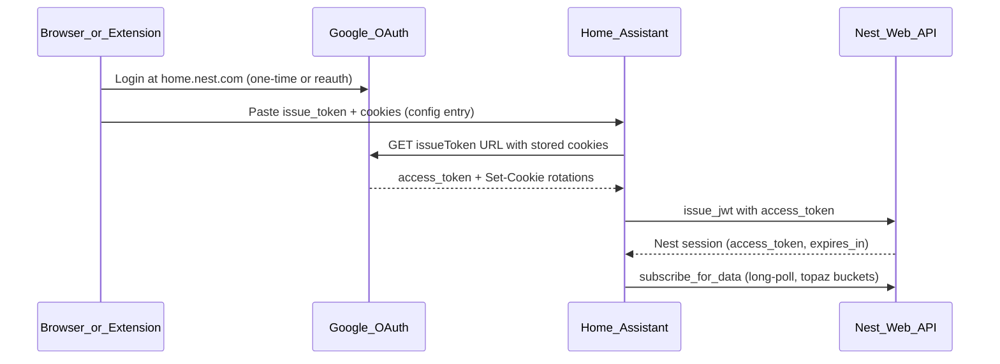

# Nest Protect authentication — limitations and options

This document records what we know about authenticating **ha-nest-protect** with Google/Nest. Read this before re-investigating OAuth or alternative APIs.

Last updated: 2026-06-12 (from debug sessions and community research).

## TL;DR

- **Nest Protect has no official Google API.** The Smart Device Management (SDM) OAuth integration in Home Assistant does not support Protect.
- **This integration uses the same unofficial web API** as home.nest.com (`topaz` device buckets), via cookie + `issueToken` auth.
- **There is no portable OAuth refresh token** for new Google-account setups (Google deprecated browser token generation in 2022).
- **Google session cookies expire** on a server-side schedule (~2–5 hours in practice). HA stores a snapshot; when Google returns `USER_LOGGED_OUT`, fresh cookies from a browser are required.
- **The Chrome extension works without re-login** because Chrome still has a live Google session — it re-captures cookies, not because HA can self-heal forever.

---

## What this integration uses today

Stored credentials in the config entry:

| Field | Purpose |
|-------|---------|
| `issue_token` | Full `iframerpc?action=issueToken` URL from Google |
| `cookies` | Google session cookie header string |
| `refresh_token` | Legacy only — see below |

Runtime persistence (per config entry):

| Store | Purpose |
|-------|---------|
| `nest_protect_{entry_id}` | Nest session + transport URL for faster startup |

---

## Official Google OAuth (SDM API) — not for Protect

The [official HA Nest integration](https://www.home-assistant.io/integrations/nest/) uses Google's **Smart Device Management API**:

- Proper OAuth2 with refresh tokens
- Automated token renewal
- $5 Google Device Access fee
- Pub/Sub for push updates

**Supported devices:** thermostats, cameras, doorbells, Hub Max only.

**Nest Protect is not supported** and has not been announced for SDM.

References:

- [Google supported devices](https://developers.google.com/nest/device-access/supported-devices)
- [README](../README.md) — "Google SDM doesn't support Nest Protect"

---

## Legacy OAuth `refresh_token` — dead for new setups

The codebase still supports `refresh_token` in `config_flow.py` and `NestClient.get_access_token_from_refresh_token()`, but:

- Google **deprecated the browser out-of-band (OOB) OAuth flow** in October 2022
- **New refresh tokens cannot be obtained** via browser login anymore
- homebridge-nest documents this: [issue #575](https://github.com/chrisjshull/homebridge-nest/issues/575)
- Pre-existing refresh tokens may continue working until password change or revocation — not viable for new users

Do not plan features that depend on generating new refresh tokens from a browser.

If an `issueToken` response ever includes a `refresh_token`, the integration persists it automatically. Users who already have a legacy `refresh_token` can still use the manual config-flow path.

---

## Cookie + issueToken auth — how it works and why it expires

This is what home.nest.com uses internally. Community integrations (homebridge-nest, ha-nest-protect, nest_legacy) reverse-engineer it.

### Setup

1. User signs into Google at home.nest.com (browser or Chrome extension opens the page).
2. DevTools or the extension captures:
   - **issue_token** — request URL for `iframerpc?action=issueToken`
   - **cookies** — full `Cookie` header (homebridge recommends the `oauth2/iframe` request, not only `issueToken`)
3. HA stores both in the config entry.

### Runtime refresh (automated within HA)

- HA calls `issueToken` with stored cookies **only when the Nest session or Google access token needs renewal** (not on a fixed 15-minute timer).
- On startup, one proactive `issueToken` call refreshes cookies before subscribing.
- Google may return `Set-Cookie` headers; merged cookies, updated `issue_token` URLs, and any rare `refresh_token` values are persisted back to the config entry.
- Google access token is exchanged for a Nest session via `issue_jwt`.
- Nest session is used for `subscribe_for_data` (real-time Protect updates).

### Why auth still fails periodically

Google enforces a **server-side session lifetime** on cookie-based auth. Debug logs showed:

- Proactive `issueToken` succeeding for ~2 hours, then `USER_LOGGED_OUT`
- homebridge-nest reports similar ~2–5 hour expiry ([issue #630](https://github.com/chrisjshull/homebridge-nest/issues/630))
- Rotating 2 cookies per refresh does not prevent hard session invalidation
- HA reboot with dead cookies fails at tier-2 auth even if a persisted Nest session exists in the Store

`USER_LOGGED_OUT` means: **stored cookies are no longer valid**. HA cannot recover without new cookies from a browser (extension or manual paste).

### Why the Chrome extension does not require re-login

The extension opens home.nest.com while **Chrome still has an active Google session**. It re-captures `issue_token` + cookies from network traffic. The user is not typing credentials again — the browser session is doing the work.

HA has no browser. It only has the last saved cookie string.

See [chrome_extension/README.md](../chrome_extension/README.md).

---

## Alternative APIs for Nest Protect

| Option | Protect? | Auth | Notes |
|--------|----------|------|-------|
| **ha-nest-protect** (this repo) | Yes | Cookies + issueToken | Real-time subscriber on `topaz` buckets |
| **[nest_legacy](https://github.com/tronikos/nest_legacy)** | Yes | Same | Broader device support, same API family |
| **homebridge-nest** | Yes | Same | Same cookie ceiling |
| **Official HA Nest (SDM)** | **No** | OAuth2 | Best auth, wrong devices |
| **Works with Nest** | Was yes | API key | Deprecated 2019 |
| **Local / LAN protocol** | No | — | Protect is cloud-only |

**Switching integrations does not avoid cookie auth.** All community options hit the same undocumented API.

---

## Strategies evaluated

### HA-only (current plan direction)

Maximize uptime without an always-on browser:

- Persist rotated cookies and sync Nest session after refresh
- Capture fuller cookie sets at setup (`oauth2/iframe` header)
- Call `issueToken` only when tokens expire (avoid hammering Google)
- Keep subscriber alive when cookies die; prompt reauth once
- Survive HA reboots when cookies/session still valid

**Ceiling:** Periodic manual reauth via extension or manual paste when Google invalidates the session.

### Browser-assisted (not current scope)

Chrome extension periodically pushes fresh credentials to HA while Google remains signed in on a PC. Matches extension UX (no password re-entry). Requires always-on browser + user opt-in.

### Legacy refresh_token

Only if user already possesses a token from before 2022 deprecation.

---

## Code references

| Area | File |
|------|------|
| Config entry fields | `custom_components/nest_protect/const.py` |
| Cookie auth | `custom_components/nest_protect/pynest/client.py` → `get_access_token_from_cookies` |
| Refresh token auth (legacy) | `get_access_token_from_refresh_token` |
| Session tiers + persistence | `custom_components/nest_protect/session.py` |
| Cookie persist to config | `custom_components/nest_protect/__init__.py` → `_persist_refreshed_auth` |
| Chrome extension capture | `chrome_extension/background.js` |
| Reauth flow | `custom_components/nest_protect/config_flow.py` → `async_step_reauth` |

---

## When investigating auth bugs

1. Check logs for `USER_LOGGED_OUT` vs `NotAuthenticatedException` (401 on Nest API).
2. Distinguish **dead Google cookies** (need browser reauth) from **stale Nest session** (refresh via issueToken if cookies still valid).
3. Confirm rotated cookies are persisted to the config entry after successful `issueToken`.
4. Do not assume official SDM OAuth or new refresh tokens are available for Protect.

---

## External references

- [homebridge-nest — cookies method](https://github.com/chrisjshull/homebridge-nest)
- [homebridge-nest #575 — refresh token deprecated](https://github.com/chrisjshull/homebridge-nest/issues/575)
- [homebridge-nest #630 — cookie auth expiry discussion](https://github.com/chrisjshull/homebridge-nest/issues/630)
- [Google Device Access — supported devices](https://developers.google.com/nest/device-access/supported-devices)
- [Google OAuth OOB migration](https://developers.google.com/identity/protocols/oauth2/resources/oob-migration)
